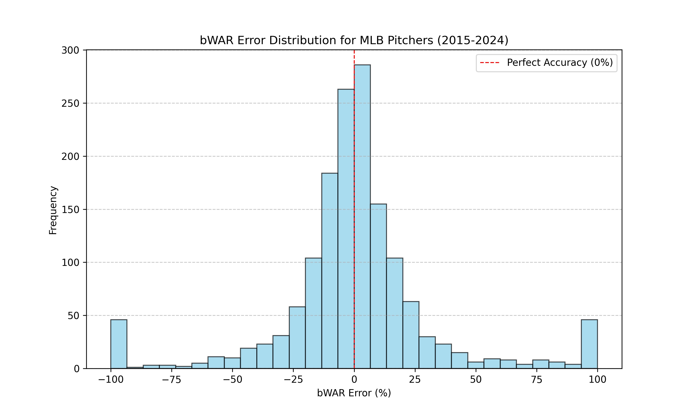

# Boba | WAR Machine Training

This document outlines the process for training a machine learning (ML) model to predict Minor League Baseball (MiLB) pitcher Wins Above Replacement (WAR) for the 2025 season, based on 2024 performance data. This project was developed for the 2025 Google X MLB Hackathon.

Our WAR machine (H2O.ai Stacked Ensemble) achieves an impressive 97% accuracy (R²) in predicting MiLB prospects, based on our testing results.

## Overview

We leverage sabermetrics, the statistical analysis of baseball data, to predict the potential of MiLB prospects. Our goal is to accurately forecast pitcher WAR, a comprehensive measure of a player's value, using their current MiLB performance data.

---

## Methodology

We utilized H2O.ai, an open-source, scalable machine learning platform, for model training and prediction. H2O.ai's AutoML capabilities streamline the process of training and tuning multiple models.

### Models

We trained and compared the following H2O.ai regressor models:

## Model Performance Comparison

| Model         | RMSE  | MAE  | R²   | Training Time (s) | Inference Time (s) |
|------------------------|--------|--------|--------|------------------|------------------|
| H2O Stacked Ensemble | 0.186 | 0.115 | 0.969 | 1156.08     | 0.312      |
| H2O GBM        | 0.222 | 0.135 | 0.956 | 534.10      | 0.593      |
| H2O DRF        | 0.233 | 0.143 | 0.951 | 784.67      | 0.218      |
| H2O XGBoost     | 0.236 | 0.144 | 0.950 | 1055.51     | 0.154      |

The training process involved the following steps:

1. Data Loading
2. Data Splitting (Train/Test)
3. Data Cleaning
4. Missing Value Imputation
5. Feature Scaling
6. Model Training (using H2O.ai AutoML)
7. Model Evaluation
8. Prediction on 2024 MiLB data
9. Model Saving
10. Prediction Saving

### Data Collection

#### Target Variable: Wins Above Replacement (WAR)

WAR is a comprehensive statistic representing a baseball player's overall value to their team compared to a hypothetical "replacement player" [1]. It considers offensive, defensive, and baserunning contributions, adjusted for position and playing time. Higher WAR indicates greater value. A "replacement player" is typically defined as a player readily available but not considered a core MLB roster member [1]. In the context of MiLB, top MiLB players can be considered replacement level for MLB teams.

#### Data Sources and Availability

We use the WAR metric provided by the MLB Stats API [2]. It's important to note that WAR calculations can vary (e.g., FanGraphs WAR (fWAR) [3], Baseball-Reference WAR (bWAR) [4]). Due to data accessibility constraints, we use the MLB Stats API's WAR.

Our analysis focuses on publicly available pitching data from the MLB Stats API ([pitching](https://statsapi.mlb.com/api/v1/stats?stats=sabermetrics&group=pitching&sportId=1&season=2024&playerPool=ALL&limit=50&offset=50)). We use a 10-year data set (2015-2024) for training and testing, ultimately predicting WAR for 2024 MiLB prospects.

Due to time constraints, we excluded hitting and fielding data. While metrics like Weighted On-base Average (wOBA), Weighted Runs Created Plus (wRC+), Weighted Runs Above Average (wRAA), Ultimate Zone Rating (UZR), and Defensive Runs Saved (DRS) are valuable, incorporating them would significantly increase model complexity. We prioritize WAR due to its comprehensive nature, which incorporates offensive and defensive contributions for overall pitcher performance.

### Model Training

Models are trained using H2O.ai's AutoML feature with a maximum of 10 models. Features consist of various pitching statistics (e.g., games played, innings pitched, strikeouts). The target variable is WAR.

#### Feature and Target Variable Summary

The following tables summarize the data used for model training, excluding player identification information. Only a subset of pitching statistics were used for training.

#### Player Information

| Field     | Description        |
|----------------|---------------------------|
| `player.id`  | Unique player identifier. |
| `player.fullName`| Player's full name.    |

#### Pitching Statistics

| Field           | Description                  |
|---------------------------|-------------------------------------------------|
| `stat.gamesPlayed`    | Number of games pitched.            |
| `stat.gamesStarted`    | Number of games started.            |
| `stat.gamesFinished`   | Number of games finished.            |
| `stat.completeGames`   | Number of complete games.            |
| `stat.shutouts`      | Number of shutouts.               |
| `stat.wins`        | Number of wins.                 |
| `stat.losses`       | Number of losses.                |
| `stat.saveOpportunities` | Number of save opportunities.          |
| `stat.saves`       | Number of saves.                |
| `stat.blownSaves`     | Number of blown saves.             |
| `stat.holds`       | Number of holds.                |
| `stat.inningsPitched`   | Innings pitched (can be a formatted string).  |
| `stat.runs`        | Runs allowed.                  |
| `stat.earnedRuns`     | Earned runs allowed.              |
| `stat.battersFaced`    | Number of batters faced.            |
| `stat.atBats`       | At-bats against the pitcher.          |
| `stat.hits`        | Hits allowed.                  |
| `stat.doubles`      | Doubles allowed.                |
| `stat.triples`      | Triples allowed.                |
| `stat.homeRuns`      | Home runs allowed.               |
| `stat.baseOnBalls`    | Walks issued.                  |
| `stat.intentionalWalks`  | Intentional walks issued.            |
| `stat.strikeOuts`     | Strikeouts.                   |
| `stat.hitByPitch`     | Batters hit by pitch.              |
| `stat.balks`       | Balks committed.                |
| `stat.wildPitches`    | Wild pitches.                  |
| `stat.groundOuts`     | Groundouts induced.               |
| `stat.airOuts`      | Flyouts induced.                |
| `stat.stolenBases`    | Stolen bases allowed.              |
| `stat.caughtStealing`   | Runners caught stealing.            |
| `stat.sacBunts`      | Sacrifice bunts allowed.            |
| `stat.sacFlies`      | Sacrifice flies allowed.            |
| `stat.catchersInterference`| Catcher's interference while pitching.     |
| `stat.pickoffs`      | Pickoffs.                    |
| `stat.inheritedRunners`  | Inherited runners.               |
| `stat.inheritedRunnersScored`| Inherited runners scored.          |
| `stat.numberOfPitches`  | Pitches thrown.                 |
| `stat.strikes`      | Strikes thrown.                 |

### Model Evaluation

Model performance is evaluated on the held-out test set using the following metrics:

* Root Mean Squared Error (RMSE)
* Mean Absolute Error (MAE)
* R-squared (R²)
* Symmetric Mean Absolute Percentage Error (sMAPE)

---

## References

[1] Baumer BS, Matthews GJ. A statistician reads the sports page: There is no avoiding WAR. Chance. 2014 Jul 3;27(3):41-4. [https://doi.org/10.1080/09332480.2014.965630](https://doi.org/10.1080/09332480.2014.965630)
[2] Todd Rob. MLB-StatsAPI – GitHub Repository. [https://github.com/toddrob99/MLB-StatsAPI](https://github.com/toddrob99/MLB-StatsAPI)
[3] Baseball-Reference. Baseball-Reference.com WAR Explained. [https://www.baseball-reference.com/about/war_explained.shtml](https://www.baseball-reference.com/about/war_explained.shtml)
[4] Piper Slowinski. Calculating WAR for Position Players. FanGraphs. 2012 Apr 2. [https://library.fangraphs.com/war/war-position-players/](https://library.fangraphs.com/war/war-position-players/)
